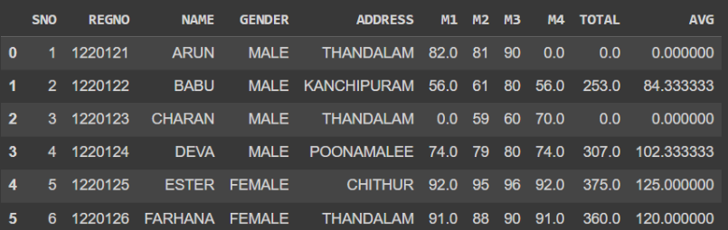

# Exno:1
Data Cleaning Process

# AIM
To read the given data and perform data cleaning and save the cleaned data to a file.

# Explanation
Data cleaning is the process of preparing data for analysis by removing or modifying data that is incorrect ,incompleted , irrelevant , duplicated or improperly formatted. Data cleaning is not simply about erasing data ,but rather finding a way to maximize datasets accuracy without necessarily deleting the information.

# Algorithm
STEP 1: Read the given Data

STEP 2: Get the information about the data

STEP 3: Remove the null values from the data

STEP 4: Save the Clean data to the file

STEP 5: Remove outliers using IQR

STEP 6: Use zscore of to remove outliers

# Coding and Output

```py
# Developed By: GURU REVANTH KUMARAVEL RADHIKA
# Register Number: 212223230065
```
<table>
  <tr>
    <td width=50%>


### 1) Read and display DataFrame
```Python
import pandas as pd
df=pd.read_csv('/content/SAMPLEDS.csv')
df
```
  </td>
  <td>
              
#### OUTPUT:


</td>
</tr>
<tr>
  <td width=50%>
              
### 2) Display head
```Python
df.head()
```
  </td>
  <td>
              
#### OUTPUT:


</td>
</tr>
<tr>
  <td width=50%>

### 3) Display tail
```Python
df.tail()
```
  </td>
  <td>
              
#### OUTPUT:


</td>
</tr>
<tr>
  <td width=50%>

### 4) Info of datafram
```Python
df.info()
```
  </td>
  <td>
              
#### OUTPUT:


</td>
</tr>
<tr>
  <td width=50%>

### 5) Describe about the dataframe
```Python
df.describe()
```
  </td>
  <td>
              
#### OUTPUT:


</td>
</tr>
<tr>
  <td width=50%>

### 6) Shape of the datafram
```Python
df.shape
```
  </td>
  <td>
              
#### OUTPUT:


</td>
</tr>
<tr>
  <td width=50%>

### 7) Checking tha NUll values
```Python
df.isnull().sum()
```
  </td>
  <td>
              
#### OUTPUT:


</td>
</tr>
<tr>
  <td width=50%>

### 8) Drop the Null values
```Python
x=df.dropna(how='any')
x
```
  </td>
  <td>
              
#### OUTPUT:


</td>
</tr>
<tr>
  <td width=50%>

### 9) Drop the Null values in Total
```Python
tot=df.dropna(subset=['TOTAL'],how='any')
tot
```
  </td>
  <td>
              
#### OUTPUT:


</td>
</tr>
<tr>
  <td width=50%>

### 10) FIll the Null values
```Python
df.fillna(0)
```
  </td>
  <td>
              
#### OUTPUT:


</td>
</tr>
<tr>
  <td width=50%>

### 11) Finding the mean value
```Python
mn=df.TOTAL.mean()
mn
```
  </td>
  <td>
              
#### OUTPUT:


</td>
</tr>
<tr>
  <td width=50%>

### 12) Fill Null value with Mean value
```Python
df.head()
```
  </td>
  <td>
              
#### OUTPUT:

</td>
</tr>
<tr>
  <td width=50%>

### 13) Final output
```Python
for x in df.index:
  if df.loc[x,"AVG"]>100:
    df.drop(x,inplace=True)
df
```
  </td>
  <td>
              
#### OUTPUT:


</td>
</tr>
<tr>
  <td width=50%>

### 14)Cut and paste portion of image
```Python
     import cv2
     image=cv2.imread('Deepika.jpg',1)
     image=cv2.resize(image,(400,400))
     tag =image[150:200,110:160]
     image[110:160,150:200] = tag
     cv2.imshow('partimage1',image)
     cv2.waitKey(0)
     cv2.destroyAllWindows()
```
  </td>
  <td>

#### OUTPUT:


 </td>
 </tr>
</table>

# Result
The data clearning has beeen done successfully.